# Exploring the Differences Between Remakes and Their Originals

## Obtaining the Dataset
For this, I downloaded all the remakes and their originals listed on [wikipedia](https://en.wikipedia.org/wiki/Lists_of_film_remakes). And also from [this wikipedia](https://en.wikipedia.org/wiki/List_of_remakes_and_adaptations_of_Disney_animated_films) because these weren't all included in the first link. I cleaned up the titles and such so that I could map the films to the Kaggle dataset of films.

Columns were then added:

- profit = revenue - budget
- combined rating = averaging the rating from IMDb and TMDb
- rating category = low for films with a rating below the median and high for those above
- decade
- star average career profit = first named actor's average film profit of all films prior to current film
- director career average profit = director's average film profit of all films prior to current film
- relative popularity = popularity divided by the average popularity for the year of the film's release, this accounts for a film being very popular in e.g. 1960 not being as popular in e.g. 2024
- inflation was accounted for in profits and budgets by using the library 'quantmod' to extract Consumer Price Index (CPI) data
- type = remake or original
- orig_rating and orig_year
- avg_remake_rating
- rating_diff = difference in rating between remake and original
- year_diff = number of years between original and remake

The final dataset contained 1242 films, with 562 distinct groups. There were 678 remakes.

## Visualising Relationships
So, the first plot I made was a bar chart showing the 10 highest rated films in the remake only dataset and the rating of their original film.

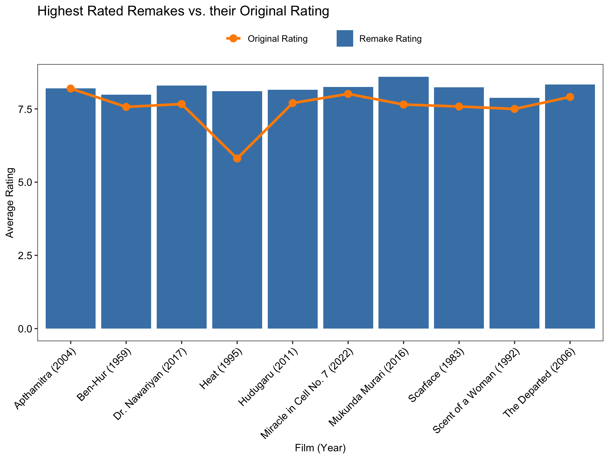

I also plotted the 10 highest rated original films with their highest rated remake.

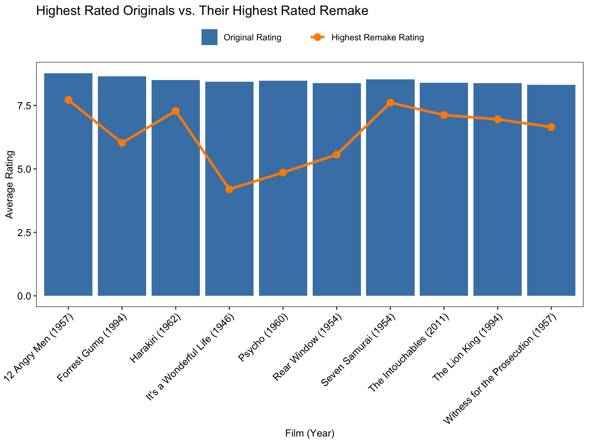

Next, I performed a basic PCA on the remake data to see if the rating category (high, low) can be separated. As is clear though, they overlap a lot and cannot really be separated by these variables. Interestingly, dimension 2, which captures 22.2% of the variation, shows year_diff pointing almost straight up while orig_year points down. This suggests films at the top have a very big time difference between original and remake, while those at the bottom are modern originals remade very quickly.

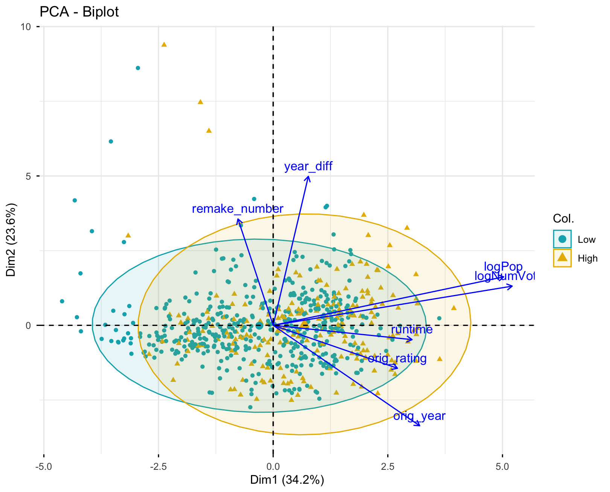

As the PCA couldn't separate the data on rating category, I next tried using original film year category, which are called eras from now on. I created the eras categories of Pre-1960, 1960-1994, and 1995+ based on when the original film was released. Then I reran the PCA. As we can see, there is more distinct separation than rating category, but the data is still largely overlapping, with the middle category overlapping completely with the other two.

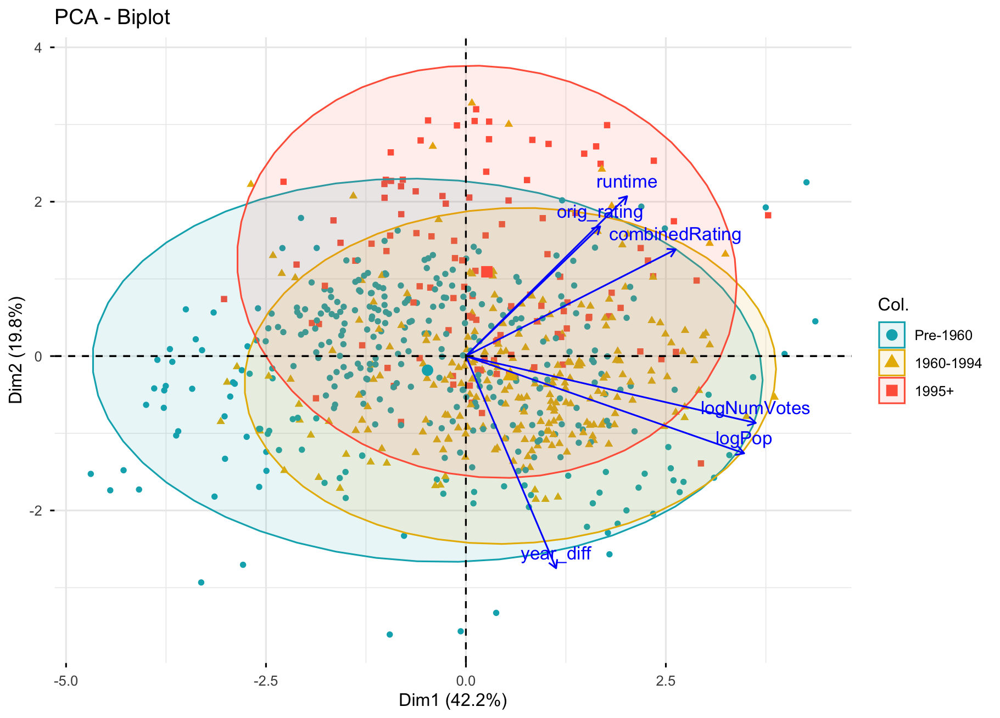

Lastly, I repeated the PCA but kept in budget data. However, only 298 films contained financial information, and as this extra variable did not separate the data any better than without, I excluded it from further analysis so I could use the full dataset.

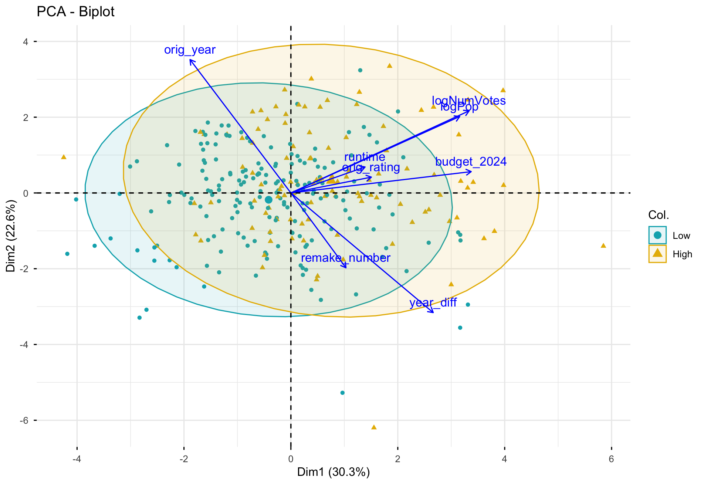

## Modelling
I cannot even tell you how many models I ran; random forests, GLMs, GAMs, and others I've probably forgotten. Nothing fit very well at all, so I was forced to come to the conclusion that film data is extremely noisy and what makes a great film is very hard nigh on impossible with the variables available in the dataset. So in the end, I decided to perform cluster analysis, using Gaussian Mixture Models (GMMs), just for exploration purposes; I can't draw any conclusions from this really. I used the PCA data on the first four dimensions as these accounted for over 95% of the variation. This separated the data into 7 clusters.

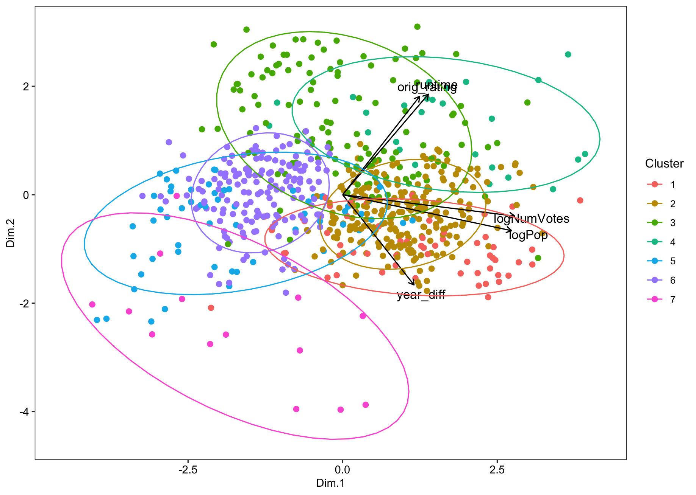

I found the average variable values for each cluster, which can be seen [here.](src/cluster_averages.md) These have also been plotted, with the data scaled to better see the differences.

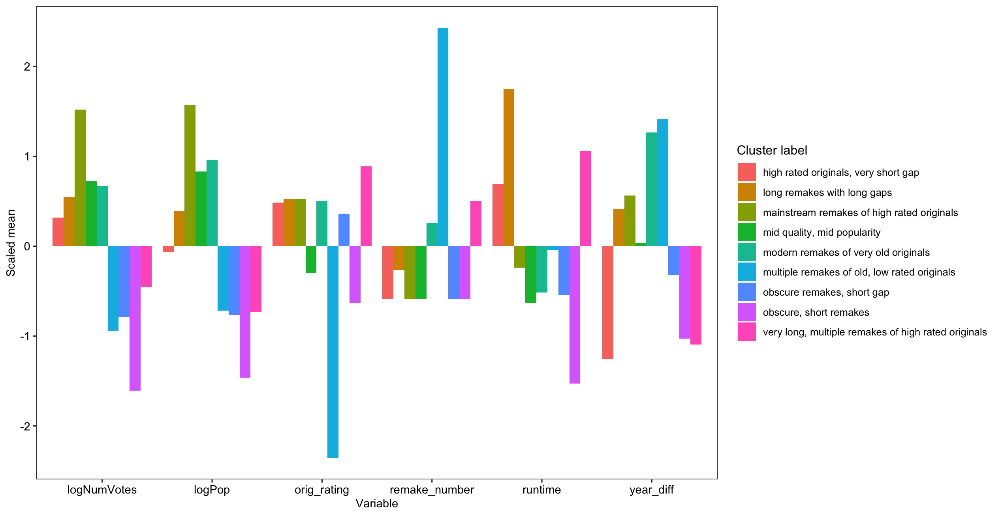

## Linear Models
As the models were yielding little interesting results, I decided to try running a linear model on all available variables on the rating of the remake. I started with including all two-way interactions. I then dropped terms using LRT until the model included only terms that, when removed, made the model significantly worse.

From this, I ended up with 22 significant variables affecting rating of remake, and an adjusted R^2 value of 0.5254. Some interesting findings from this include runtime significantly affecting the remake rating but is dependent on when the original film came out. As we can see, all eras give a positive gradient, meaning as runtime increases, rating increases. But the rate at which this occurs is highest in original films from before 1994. If the original film came out after that, runtime has less of an effect on remake rating.

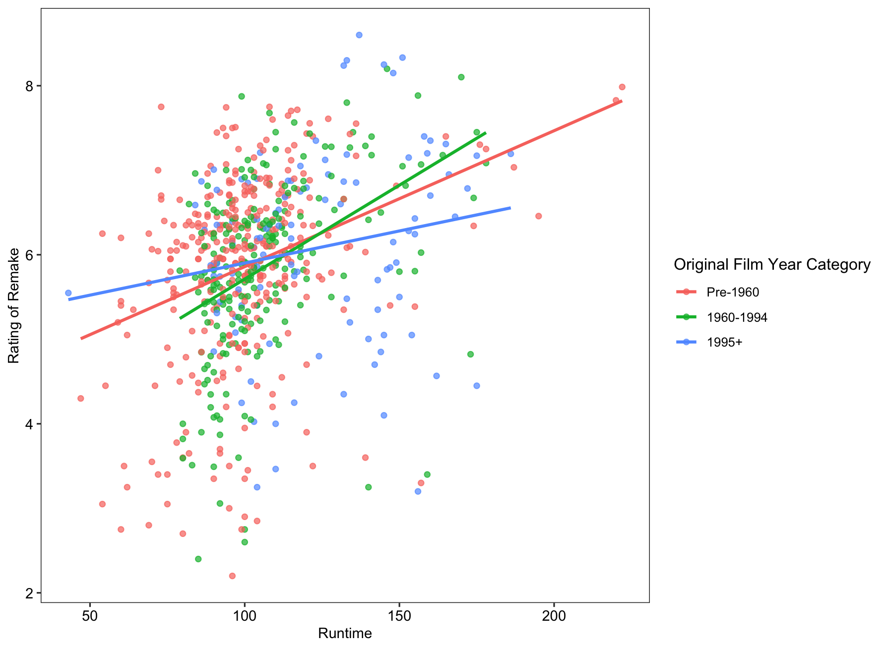

A similar effect was seen in popularity, whereby popularity affected rating less in modern originals than those from before 1994.

Next, I ran a binomial linear model for a binary response variable of 1 (remake is better) or 0 (remake is worse). I did not include any interactions as this crashed the model. There was an adjusted R^2 value of 0.4052. The rating of the original film was stongly associated with this, which makes sense because if the original is highly rated, it's harder for the remake to perform better. The plot can be seen [here](plots/binary_origrating.png). However, because of the overwhelming proportion of remakes that are worse than the original compared to those that are better, all other variables had only a small effect size on remake performance.

## Hypothesis Testing
Finally, I had some specific questions I wanted to answer. I really don't like the number of remakes at the moment, I think people should just think up some new stories. However, we live in a capitalist society, so if production companies think they can make money off soemthing, they'll do it. So the first hypothesis I wanted to explore was has the number of remakes increased significantly in the last ~15 years? Now, obviously it has increased over time just because more films are being made now, so firstly I normalised the data, by calculating the proportion of remakes per total films per year.

With this data, I ran a linear model on whether propotion of remake is significantly affected by year. I ran this for the last 100 years and then again for the years 2000-2024. Both these models were significant, but not in the direction I was hoping for! As we can see, the proportion of remakes has decreased over the last 100 years (F(99) = 12.45, p-val = 0.000636). There is a steep increase in ~90s, followed by a sharp decrease in roughly the 2010s.

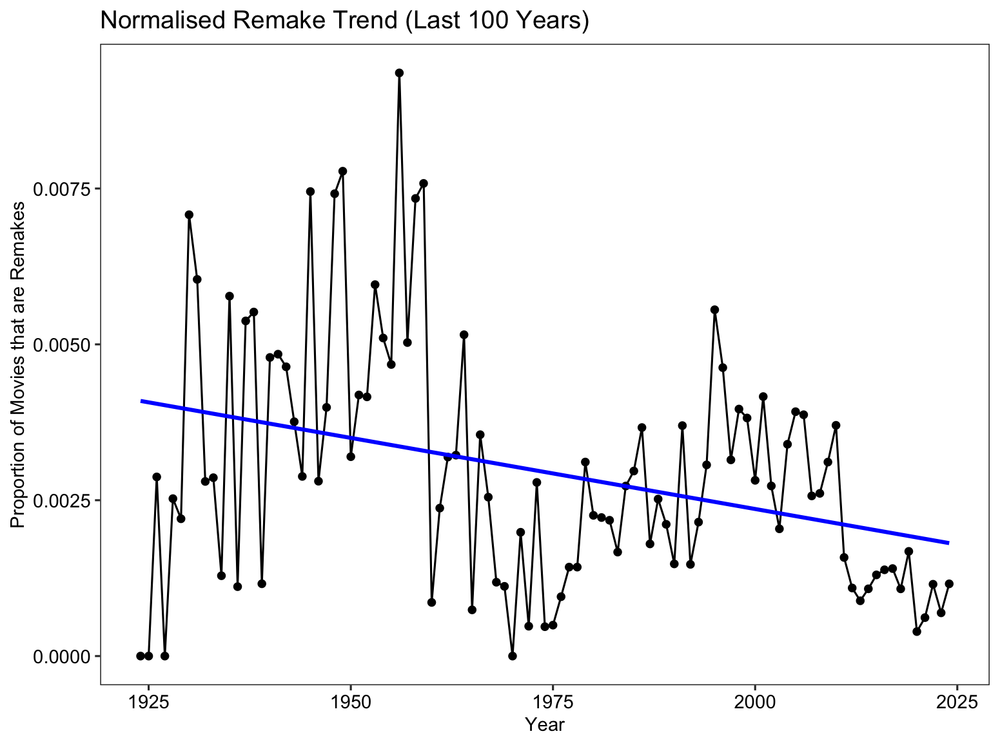

Looking at the last 25 years, there is also a significant decrease in the number of remakes (F(23) = 41.21, p-val = 1.5e-6). We can see the sharp decline more clearly now, almost separating the data into pre-2010 and post-2010.

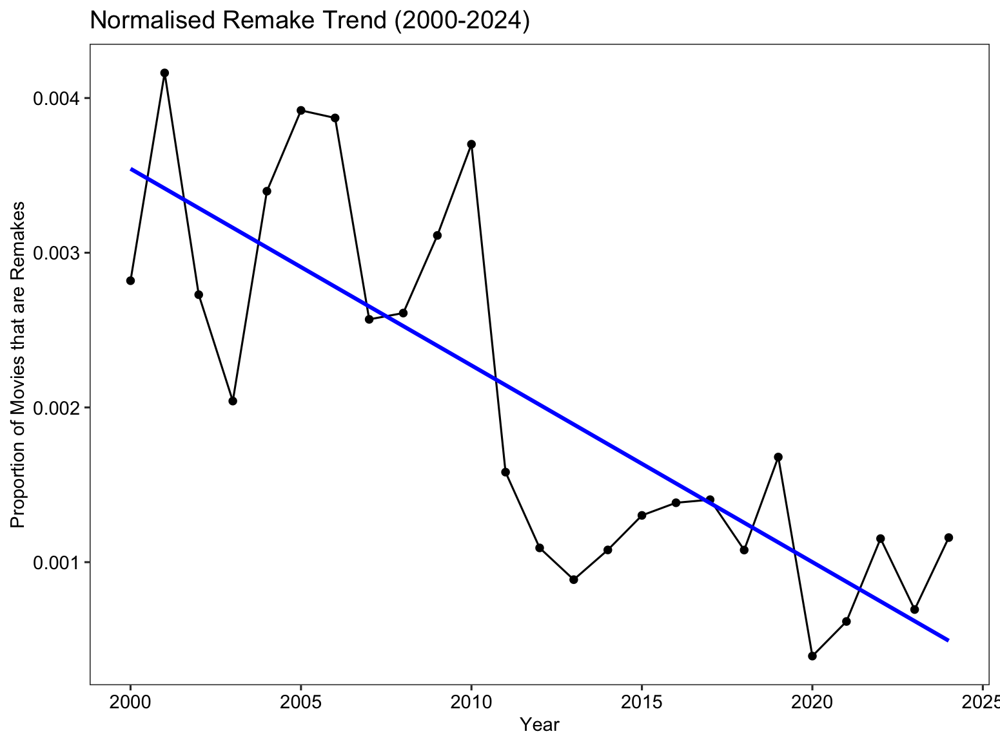

From this, I decided to see if there was a particular reason why the number of remakes dropped post-2010. So, using only the remake data from 2000-2024, I performed a linear model to see if there was a significant difference between rating of remake and the time period it came out. This revealed that remakes after 2011 performed on average better than those pre-2011 (p-val = 0.0234), which was odd because I thought maybe they made less remakes after 2011 because they realised they weren't doing as well. So next I performed a GLM on the rating difference between remake and original and the time period, but this did not yield a significant result. Next, I thought maybe less people are watching remakes post 2011 and that's why they are making less of them, but that model wasn't significant either.

I next decided to look at financial data, thinking maybe because ratings are up post 2011 despite less remakes, studios are choosing quality over quantity. So I ran a model looking at how profits are affected by time period. However, this was not significant either. Finally, I looked at the number of years between remake and originals, wondering if as ratings are up, studios are picking the originals from a specific time period that does well. But, lo and behold, not significant.

If you can't tell, I'm getting desparate now. I decided to just model every variable against time period to see if any are significantly correlated. This found the only variable that is affected by time period is the year of the original film (p-val = 0.001174). It appears that remakes post 2011 typically remade newer films than those from pre 2011. This suggests that instead of trying to remake older films that many young people have no connection with, studios started targeting franchises they do have a connection with. Because of this, they have less films to choose from to remake, possibly explaining the drop in amount of remakes. Also, we can see that a lot of films appear to have been remade from the 2010s, which obviously isn't the case for the pre-2011 data. The red lines show the median year of original film, showing 1990 for post-2011 and 1978 for pre-2011.

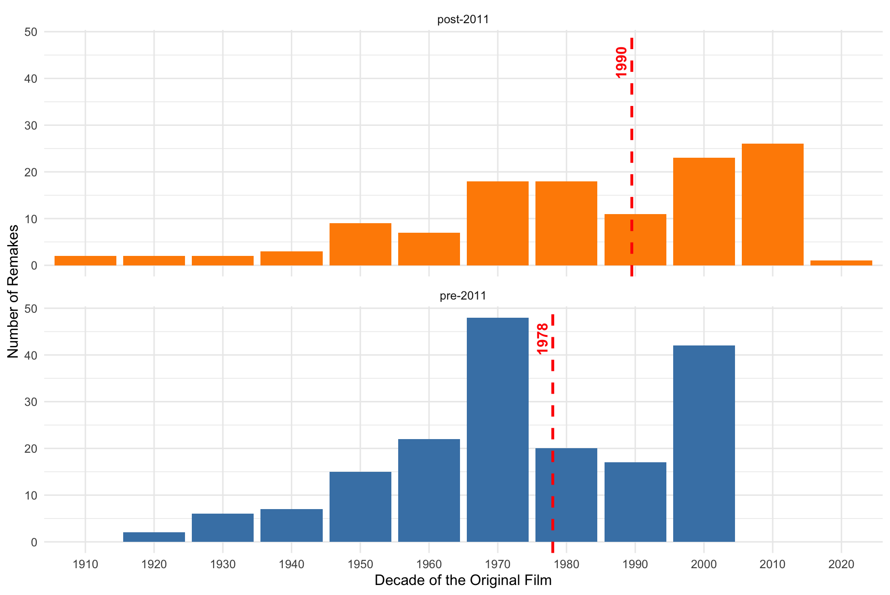