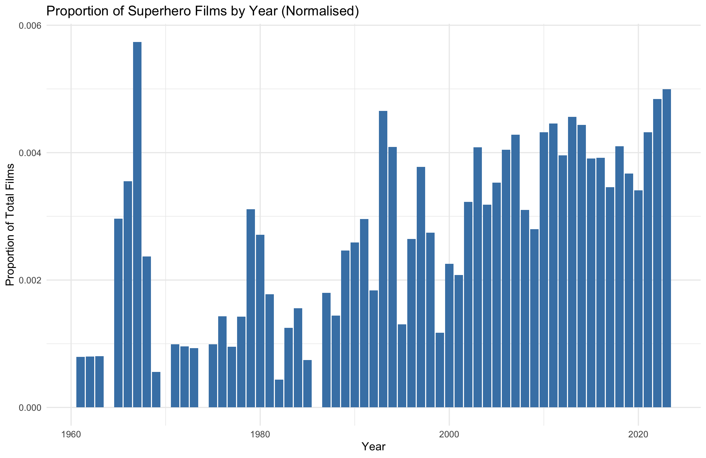
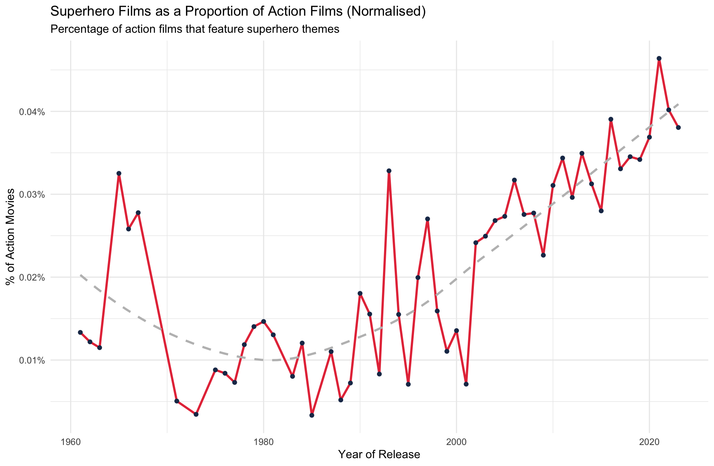
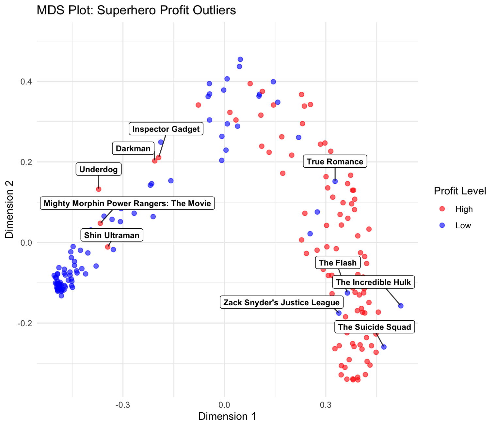
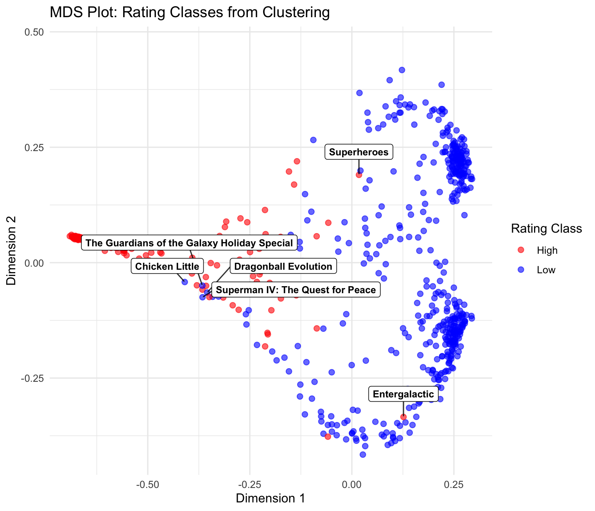
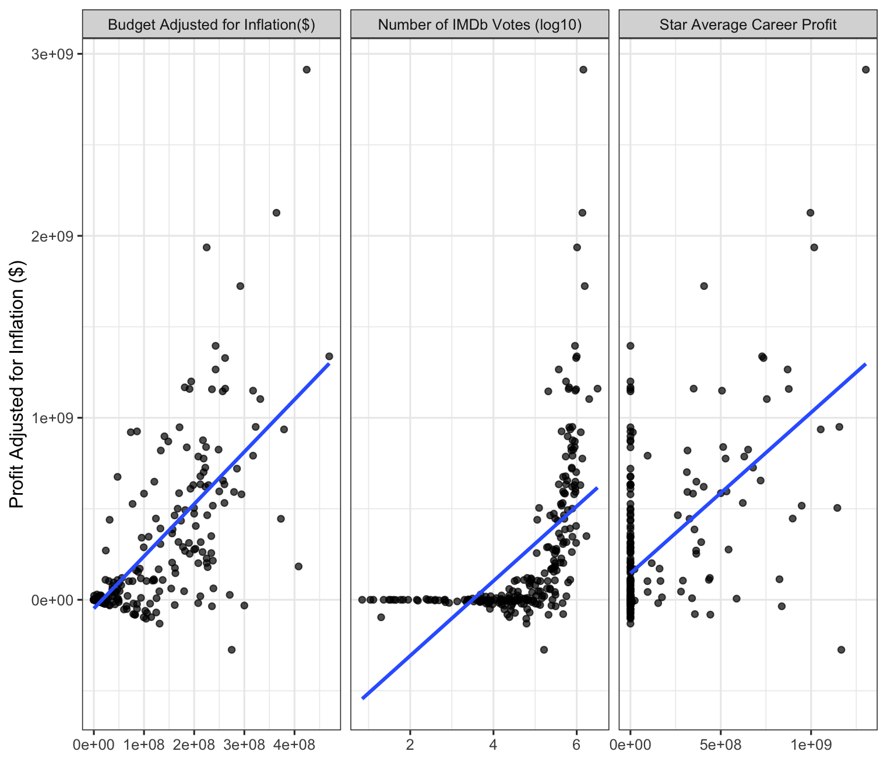
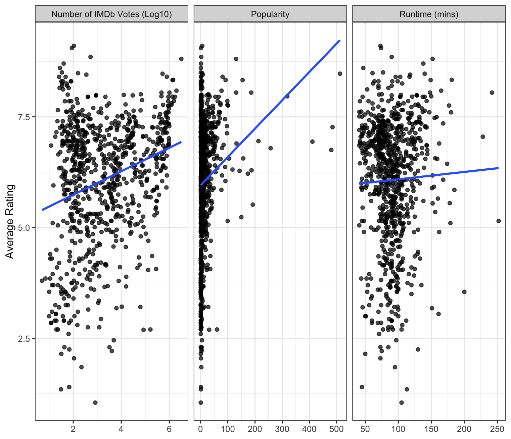
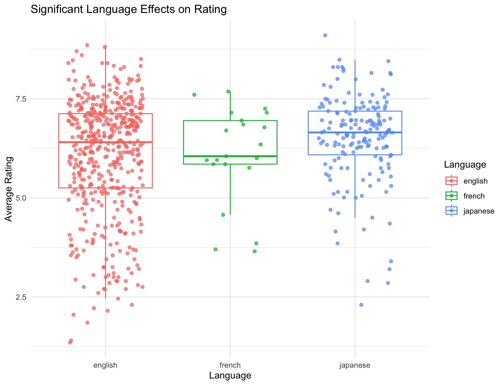

# How the Superhero Genre has Changed Over Time

## Filtering
All films are filtered first to exclude short films (<40 minutes) and those with no release date information

Superhero films were extracted by filtering 'keywords' containing 'superhero', 'marvel', 'dc', 'comic book'

Columns were then added:

- profit = revenue - budget
- combined rating = averaging the rating from IMDb and TMDb
- rating category = low (0-4 combined rating), medium (5-7 combined rating), high (7-10 combined rating)
- decade
- star average career profit = first named actor's average film profit of all films prior to current film
- director career average profit = director's average film profit of all films prior to current film

This dataset contained 804 films, ranging from 1961 to 2023

## Visualising Relationships
Started out with a simple [bar chart](plots/rise_of_superheros.png) showing the number of superhero films over time, but as the number of total films has drastically increased throughout the years, I normalised the data by grouping by year and dividing by total films per year. From this, a normalised bar chart was made.

I also looked at how the superhero sub-genre took up the action genre, by dividing the number of superhero films in the action genre per year by the number of total action films. This was visualised by a line graph.

A [boxplot](plots/superhero_ratings.png) of the combined rating in each decade was created.

Profits per year for superhero films was plotted on a [line graph](plots/profits_superheros.png) to see how this has changed over the years. For this, I filtered out films where there was no financial data available.

## Predicting Profits
I ran a Random Forest model to see which features of superhero films could predict its profits. The dataset used for this was one which filtered out films that didn't have financial data. This gave me 247 films, ranging from 1966 to 2023. Profit was split into two levels: High for films with a greater than median profit, and Low for films with a less than median profit. Running the model on this variable produced better results than running it on the continuous numerical profit variable.

The confusion matrix had an accuracy of 90% on the test data, with an OOB error rate of 12.18% on the training data. Plotting the [Mean Decrease Gini](plots/var_imp.png) of features, showed popularity and number of IMDb votes were the best predictors of profit.

Plotting the data across 2 dimensions shows high profit and low profit films to be relatively separate, but there are certain outliers. These films are those that had either high profit or low profit but contained features similar to those in the other profit category. The plot shows five outliers in the high profit category and five in the low profit category each category.

High profit films with low profit features:

- Inspector Gadget
- Might Morphin Power Rangers: The Movie
- Underdog
- Darkman
- Shin Ultraman

Low profit films with high profit features:

- The Suicide Squad
- True Romance
- The Flash
- The Incredible Hulk
- Zack Snyder's Justice League

## Predicting Average Rating
I also ran a Random Forest model on the combined rating, which I ran on all 804 films, but didn't include financial data in the model most of these films didn't have any. However, the model did not perform well on either the continuous combined rating variable or a rating catorgory of high and low created from the median. Therefore, I performed K-means clustering to determine the optimal clustering of the data and used these factors for the model.

The optimal number of clusters was 2, however, not split equally. From this, the model had an OOB error of % on the training data and a confusion matrix accuracy of 99% on the test data. The [Mean Decrease Gini plot](plots/var_imp_rating.png) showed the features number of IMDb votes and runtime to be the most predictive of average rating.

The MDS plot shows 6 outliers, 2 in the high rating class and 4 in the low. Although, overall, there is clear separation of the two clusters, particularly along the first dimension.

High rated film with low rated features:

- Superheroes
- Entergalactic

Low rated film with high rated features:

- Superman IV: The Quest for Peace
- Dragonball Evolution
- The Guardians of the Galaxy Holiday Special
- Chicken Little

## Linear Models
To then see whether the top predictive features are significantly affecting the respective variable, generalised linear models were performed.

### Profit
From this model, only budget and star power score were significant. The plots show their relationships. For both variables, as they increase, profits increase.

### Average Rating
This model revealed multiple variables to be significant. Firstly, popularity, the number of votes from IMDb, and runtime all had a significant positive relationship, as shown by plot below.

It was also found that franchises had significantly higher average ratings, which is demonstrated [here.](plots/rating_boxplot.png)

Six languages were found to be significantly associated with higher average ratings, in comparison to English. This data was filtered to only include languages that had more than 10 films to account for low numbers.

