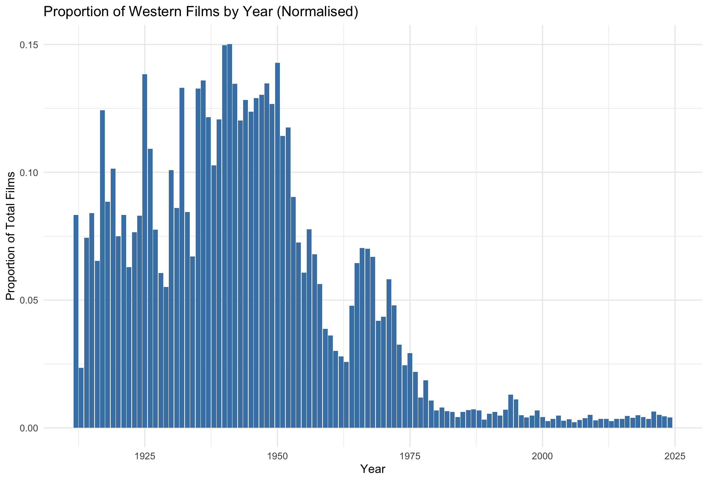
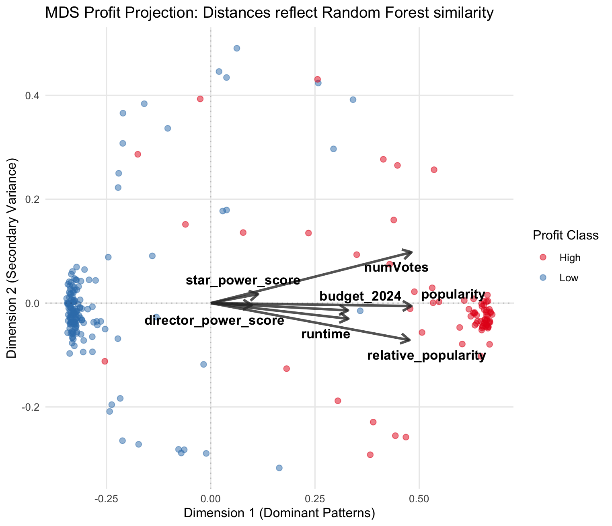
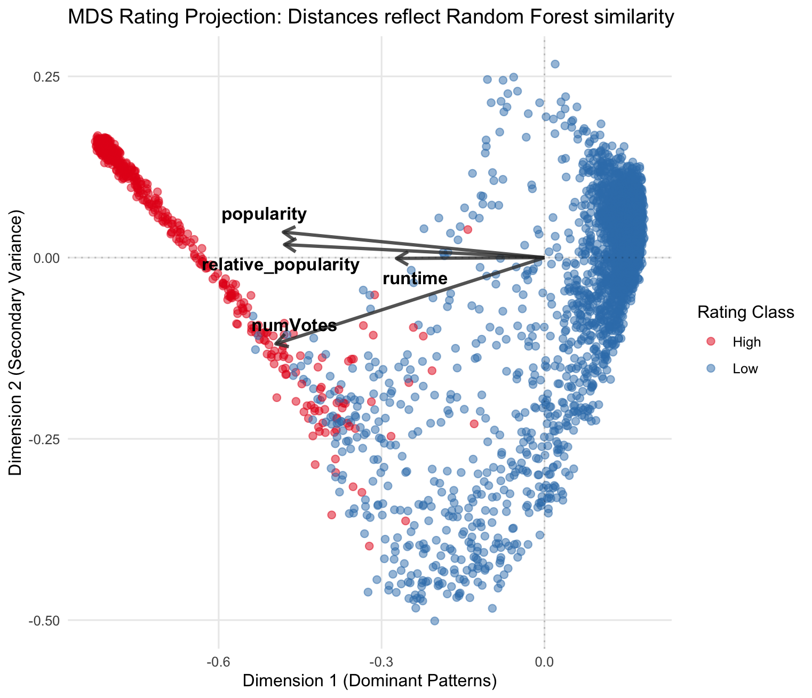
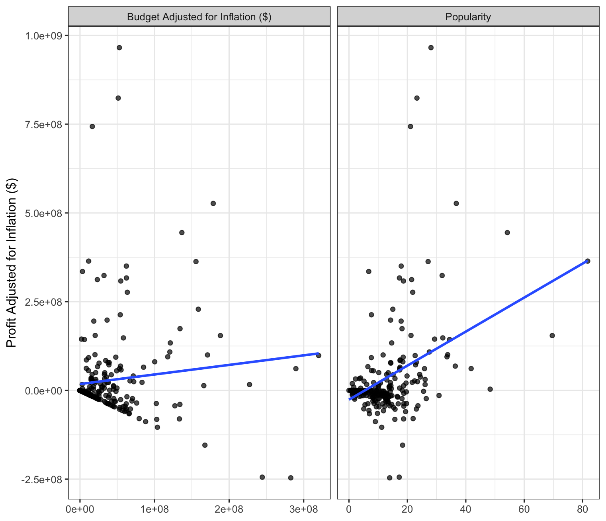
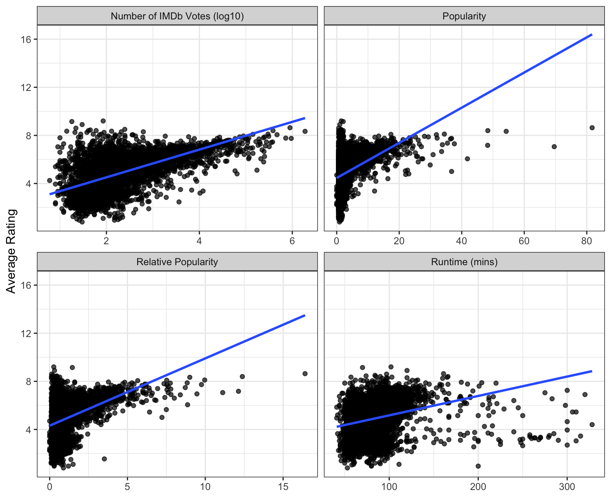

# How the Western Genre has Changed Over Time

## Filtering
All films are filtered first to exclude short films (<40 minutes) and those with no release date information

Western films were extracted by filtering 'genres' for 'western'.

Columns were then added:

- profit = revenue - budget
- combined rating = averaging the rating from IMDb and TMDb
- rating category = low (0-4 combined rating), medium (5-7 combined rating), high (7-10 combined rating)
- decade
- star average career profit = first named actor's average film profit of all films prior to current film
- director career average profit = director's average film profit of all films prior to current film
- relative popularity = popularity divided by the average popularity for the year of the film's release, this accounts for a film being very popular in e.g. 1960 not being as popular in e.g. 2024
- inflation was accounted for in profits and budgets by using the library 'quantmod' to extract Consumer Price Index (CPI) data

This dataset contained 5433 films, ranging from 1912 to 2024

## Visualising Relationships
Started out with a simple [bar chart](plots/barplot_through_time.png) showing the number of western films over time, but as the number of total films has drastically increased throughout the years, I normalised the data by grouping by year and dividing by total films per year. From this, a normalised bar chart was made.

A [boxplot](plots/boxplot_ratings.png) of the combined rating in each decade was created.

## Predicting Profits
I ran a Random Forest model to see which features of western films could predict its profits. The dataset used for this was one which filtered out films that didn't have financial data. This gave me 318 films, ranging from 1914 to 2024. Profit was originally split into two levels: High for films with a greater than median profit, and Low for films with a less than median profit. However, this model, as well as the model ran on the original, continuous profit variable, did not perform well. Therefore, I performed K-means clustering to determine the optimal clustering of the data and used these factors for the model.

The optimal number of clusters was found to be 2. The confusion matrix had an accuracy of 95% on the test data, with an OOB error rate of 3.94% on the training data. Plotting the [Mean Decrease Gini](plots/var_imp_profit.png) of features, showed popularity, the number of votes on IMDb, and relative popularity were the best predictors of profit.

Plotting the data across 2 dimensions shows high profit and low profit films to be relatively separate. The top features were plotted to show the most influential features, with longer arrows having higher predictive powers.

## Predicting Average Rating
I also ran a Random Forest model on the combined rating, which I ran on all films, but didn't include financial data in the model most of these films didn't have any. However, the model did not perform well on either the continuous combined rating variable or a rating catorgory of high and low created from the median. I, again, performed K-means clustering to determine the optimal clustering of the data and used these factors for the model.

The optimal number of clusters was 2, however, not split equally. From this, the model had an OOB error of 1.04% on the training data and a confusion matrix accuracy of 99% on the test data. The [Mean Decrease Gini plot](plots/var_imp_rating.png) showed the features popularity and number of votes to be the most predictive of average rating.

Plotting the data across 2 dimensions shows high profit and low profit films to be relatively separate. The top features were plotted to show the most influential features, with longer arrows having higher predictive powers.

## Linear Models
To then see whether the top predictive features are significantly affecting the respective variable, generalised linear models were performed.

### Profit
From this model, only popularity and budget were significant. The plots show their relationships. For both variables, as they increase, profits increase.

### Average Rating
This model revealed multiple variables to be significant. Firstly, popularity, relative popularity, runtime, and the number of votes from IMDb both had a significant positive relationship, as shown by plot below.

